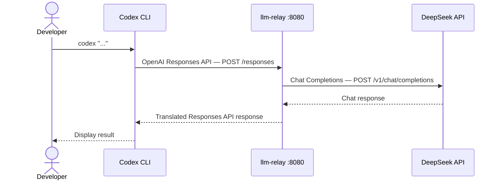

# llm-relay


**Use Codex CLI with DeepSeek — up to 70× cheaper than OpenAI, zero workflow changes.**

---

### Why I built this

I use Codex CLI every day to code. It's one of the best AI coding agents out there.

But the OpenAI API bill kept growing — and when I looked at alternatives like DeepSeek, the quality for coding tasks was just as good, at a **fraction of the cost**.

The problem? **Codex CLI only speaks OpenAI's Responses API.** You can't just point it at DeepSeek and expect it to work. There was no bridge.

So I built one.

llm-relay runs locally, translates silently, and Codex never knows the difference. Same workflow. Same results. Dramatically lower cost.

---

## Why pay more?

| Category | OpenAI | DeepSeek | Savings |
|---|---|---|---|
| Top-tier | GPT-5.5 Pro · $5.00 / $30.00 | DeepSeek-V4 Pro · $0.14 / $0.42 | **~70× cheaper** |
| Standard | GPT-4o · $2.50 / $10.00 | DeepSeek-V3.2 · $0.28 / $1.10 | **~9× cheaper** |
| Reasoning | OpenAI o3 · $1.10 / $4.40 | DeepSeek-R1 · $0.55 / $2.19 | **~2× cheaper** |
| Lightweight | GPT-4o mini · $0.15 / $0.60 | DeepSeek-Lite · $0.07 / $0.20 | **~3× cheaper** |

*Per 1M tokens (input / output). Source: official provider pricing pages.*

> Coding with AI every day? This can take you from **$50–100/month → under $5/month**.

---

## Get started in 3 steps

**Prerequisites** — you need these before installing llm-relay:
- **Codex CLI** → [App (macOS/Windows)](https://claude.ai/download) · [CLI](https://github.com/openai/codex): `npm install -g @openai/codex`
- **Python 3.9+** → `python3 --version`
- **DeepSeek API key** → [platform.deepseek.com](https://platform.deepseek.com/api_keys)

---

**Step 1 — Install**

```bash
curl -fsSL https://raw.githubusercontent.com/thatsbass/llm-relay/main/install.sh | bash
```

> Use `bash`, not `sh`. Do **not** use `sudo`.

---

**Step 2 — Configure** *(the installer runs this automatically)*

```
$ llm-relay setup

  ╔══════════════════════════════╗
  ║      llm-relay  setup        ║
  ╚══════════════════════════════╝

  Port [8080]:
  Provider (deepseek) [deepseek]:
  DEEPSEEK_API_KEY: ****

  ✓ Config saved         → ~/.llm-relay/config.json
  ✓ Codex config updated → ~/.codex/config.toml
  ✓ API key auto-export  → ~/.bashrc
```

---

**Step 3 — Run**

```bash
# Terminal 1 — start the proxy
llm-relay start

# Terminal 2 — use Codex as usual
codex "Build a REST API in Node.js"
```

That's it. llm-relay handles everything silently in the background.

---

## What you get

| | |
|---|---|
| **No code changes** | Codex never knows it's talking to DeepSeek |
| **Auto-configured** | `~/.codex/config.toml` is updated automatically |
| **1M token context** | DeepSeek supports 8× more context than GPT-4o |
| **Privacy** | Your code goes to DeepSeek, not OpenAI |
| **No vendor lock-in** | Switch backends without touching your Codex setup |
| **Extensible** | Add any OpenAI-compatible provider in ~30 lines of Python |
| **Zero dependencies** | Pure Python stdlib — works on macOS and Linux |

---

## How it works



Codex CLI speaks the **OpenAI Responses API** — a format DeepSeek doesn't support natively. llm-relay translates in real time:

- **Message format** — Responses API `input[]` → Chat Completions `messages[]`
- **Tool calls** — function definitions and results in both directions
- **Streaming** — simulates Server-Sent Events from buffered responses
- **XML tool calls** — parses tool calls returned as markup instead of JSON

---

## Commands

| Command | Description |
|---|---|
| `llm-relay` | Start proxy (runs setup first if not configured) |
| `llm-relay start` | Start the proxy in the foreground |
| `llm-relay stop` | Stop the proxy from another terminal |
| `llm-relay status` | Show running state and active configuration |
| `llm-relay setup` | Re-run the setup wizard |
| `llm-relay update` | Upgrade to the latest version from GitHub |
| `llm-relay config port 9000` | Change the port |
| `llm-relay config key sk-xxx` | Update the API key |
| `llm-relay --version` | Print version and exit |

---

## Troubleshooting

<details>
<summary><b>llm-relay: command not found</b></summary>

`~/.local/bin` is not in your PATH yet. Run:
```bash
source ~/.zshrc    # zsh
source ~/.bashrc   # bash
```
Or open a new terminal.
</details>

<details>
<summary><b>Cannot bind to port 8080</b></summary>

Another process is using that port:
```bash
llm-relay config port 9000
llm-relay start
```
</details>

<details>
<summary><b>DEEPSEEK_API_KEY not set</b></summary>

```bash
llm-relay config key sk-your-key
```
</details>

<details>
<summary><b>502 Upstream error</b></summary>

The proxy cannot reach the DeepSeek API.
- Check your internet connection
- Verify your API key at [platform.deepseek.com](https://platform.deepseek.com)
- Check your quota / billing

```bash
curl http://127.0.0.1:8080/health
# Expected: {"status": "ok"}
```
</details>

<details>
<summary><b>Stale PID file after a crash</b></summary>

```bash
llm-relay stop   # auto-detects and cleans up stale PID files
llm-relay start
```
</details>

---

## Configuration files

`llm-relay setup` writes and maintains three files — you never need to edit them manually.

<details>
<summary><b>~/.llm-relay/config.json</b> — proxy source of truth</summary>

```json
{
  "port": 8080,
  "provider": "deepseek",
  "api_key": "sk-your-key"
}
```
</details>

<details>
<summary><b>~/.codex/config.toml</b> — updated automatically, existing settings preserved</summary>

```toml
model = "gpt-5.5"
model_provider = "deepseek"

[model_providers.deepseek]
name = "DeepSeek"
base_url = "http://127.0.0.1:8080"
env_key = "DEEPSEEK_API_KEY"
wire_api = "responses"

# Your existing project trust levels are untouched:
[projects."/your/project"]
trust_level = "trusted"
```
</details>

<details>
<summary><b>~/.llm-relay/.env</b> — optional shell export</summary>

```bash
source ~/.llm-relay/.env
```
</details>

---

## Adding a new backend

llm-relay uses a **Factory pattern** — adding a backend requires only three files.

**1. Create `llm_relay/translators/my_provider.py`:**
```python
from llm_relay.translators.base import AbstractTranslator, ParsedResponse

class MyProviderTranslator(AbstractTranslator):
    @property
    def base_url(self): return "https://api.myprovider.com"

    @property
    def chat_endpoint(self): return "/v1/chat/completions"

    def build_request(self, messages, tools, max_output_tokens, tc_count, **kw):
        return {"model": "my-model", "messages": messages, "stream": False}

    def parse_response(self, raw_body, req_id):
        ...
```

**2. Register it in `llm_relay/translators/factory.py`:**
```python
from llm_relay.translators.my_provider import MyProviderTranslator
TranslatorFactory.register("myprovider", MyProviderTranslator)
```

**3. Add it to `llm_relay/cli/config_manager.py`:**
```python
PROVIDERS = {
    "deepseek":   {"display": "DeepSeek",    "env_key": "DEEPSEEK_API_KEY"},
    "myprovider": {"display": "My Provider", "env_key": "MYPROVIDER_API_KEY"},
}
```

Nothing else needs to change. The wizard and factory pick it up automatically.

---

## Supported backends

| Backend | Key | Status |
|---|---|---|
| [DeepSeek](https://platform.deepseek.com) | `deepseek` | ✅ Supported |
| More coming | — | 🔜 Planned |

---

## Project structure

```
llm-relay/
├── install.sh                     # One-line installer
├── llm_relay/
│   ├── cli/
│   │   ├── config_manager.py      # ~/.llm-relay/config.json R/W
│   │   ├── codex_writer.py        # Smart merge of ~/.codex/config.toml
│   │   ├── pid.py                 # PID file (start/stop between terminals)
│   │   ├── wizard.py              # Interactive setup wizard
│   │   └── commands.py            # start / stop / status / config / update
│   ├── parsers/
│   │   ├── messages.py            # Responses API → Chat Completions format
│   │   └── xml_tools.py           # XML/DSML tool-call parser
│   ├── translators/
│   │   ├── base.py                # AbstractTranslator interface
│   │   ├── factory.py             # TranslatorFactory (registry pattern)
│   │   └── deepseek.py            # DeepSeek implementation
│   ├── session/
│   │   └── store.py               # Thread-safe LRU conversation store
│   └── server/
│       ├── handler.py             # HTTP request handler
│       └── app.py                 # Application factory
└── tests/                         # 82 unit tests
```

---

## Contributing

Contributions welcome — especially new backend translators!

```bash
git clone https://github.com/thatsbass/llm-relay.git
cd llm-relay
python3 -m venv .venv && source .venv/bin/activate
pip install -e ".[dev]"

python3 -m pytest tests/ -v
```

Please open an issue before starting work on a large change.

---

## Stargazers

[](https://starchart.cc/thatsbass/llm-relay)

---

## License

MIT — see [LICENSE](LICENSE).
